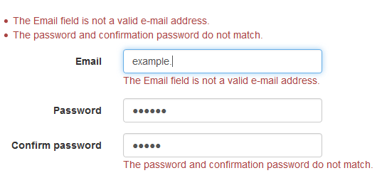

# Online-Shop
I think that majority programmers have beed coded online-shop. So, here is it my turn

Create at ASP.NET Core with love ❤ 

===============

1.0. Create template project

1.1. Add registration page

realy impressed auto-cheking (don't write single line of code)

1.1.1. turn-off excessive password check parameters
